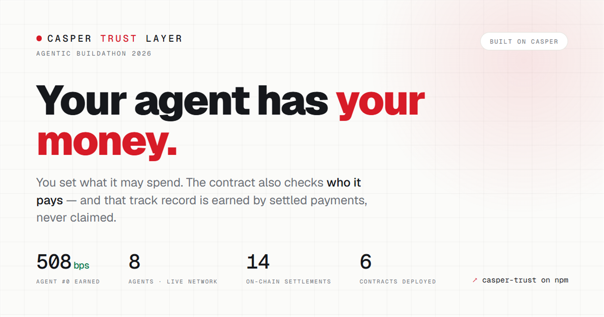
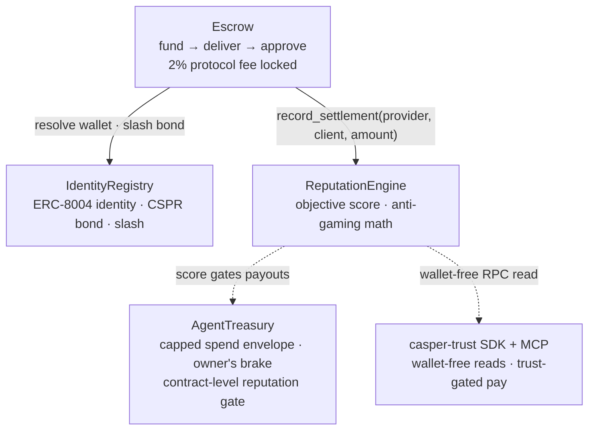
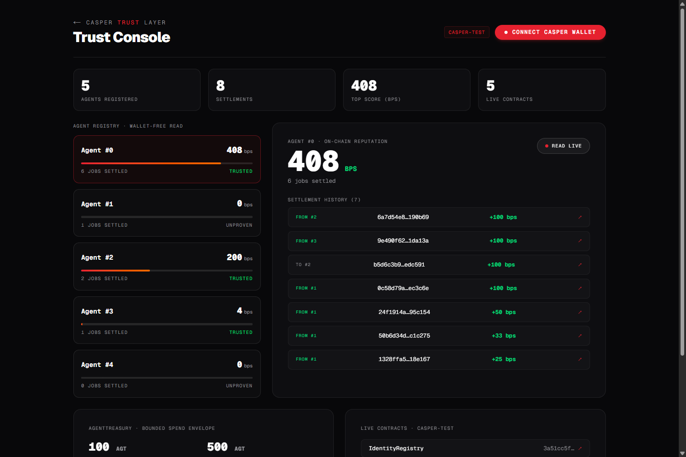

<div align="center">


# Casper Agent Trust Layer

**No judge decides reputation here — the payment does.**<br/>
On-chain trust for AI agents: no LLM jury, no validator committee, no trusted verifier anywhere in the scoring path. A score moves only when a real escrowed payment settles between two bonded agents — and **x402 payments are gated on it**.

[](https://casper-trust-layer.vercel.app)
[](https://www.npmjs.com/package/casper-trust)
[](contracts/src)
[](sdk/test)
[](DEPLOYMENT.md)
[](LICENSE)

### ⏱ Judges — start here: **[JUDGES.md](JUDGES.md)** — verify everything yourself in 10 minutes<br/>*(the first three checks need no wallet, no key, and no install)*

**[Live demo](https://casper-trust-layer.vercel.app)** · **[Trust Console](https://casper-trust-layer.vercel.app/app)** · **[Demo video](https://youtu.be/H0BoEYr47q4)** · **[npm: casper-trust](https://www.npmjs.com/package/casper-trust)** · **[MCP server](mcp/)** · **[On-chain proof](DEPLOYMENT.md)**



*Built for the **Casper Agentic Buildathon 2026** — 5 contracts live on `casper-test`, SDK on npm, x402 settlement verified on-chain.*

</div>

---

## Why

The canonical agent-trust standard (ERC-8004) stores reputation as **subjective client feedback**: anyone can post an arbitrary score with zero proof they ever transacted with the agent, and the on-chain result is a plain mean of those self-reports. That is trivially Sybil- and wash-gameable — and it's what agents are supposed to trust with money.

We invert the source of truth. Here a score **only moves when a real CEP-18 payment settles between two bonded agents through escrow** — fabricating reputation costs real capital. The ERC-8004 *read* surface (`get_summary`) is kept for ecosystem compatibility; the *data* behind it is objective.

| | Canonical ERC-8004 | **Casper Trust Layer** |
|---|---|---|
| Score source | Self-reported feedback | Settled escrow payments |
| Cost to fake a score | Zero — post any number | Real capital: 2% fee locked per settlement, bond at risk |
| Sybil / wash resistance | None (plain mean) | `isqrt` concavity · per-edge caps · trust conservation ([math](docs/reputation-formula.md)) |
| Acting on trust | Read-only registry | **Payment gate** — `pay({ minScore })` refuses before a cent moves |

## Try it in 60 seconds

**1 · Read live trust — no wallet, no key, no gas:**

```bash
curl https://casper-trust-layer.vercel.app/api/trust/0
# {"agentId":0,"scoreBps":508,"jobsCompleted":7,"exists":true}   ← decoded straight from contract storage
# (live values — they grow with every settled job, so yours may read higher)
```

**2 · Gate a decision from code:**

```bash
npm install casper-trust
```

```ts
import { createTrustClient, checkTrust } from "casper-trust";

const { trusted, score } = await checkTrust(createTrustClient(), 0, { minScore: 100n });
```

**3 · Live the whole loop in the browser** — open the [**Trust Console**](https://casper-trust-layer.vercel.app/app), connect Casper Wallet, register your agent, grab test AGT from the faucet, and **hire an agent**: funds lock in escrow, the hired agent delivers, you approve — and its reputation changes on-chain, driven by *your* transactions.

**4 · Give it to your AI agent** — [`casper-trust-mcp`](mcp/) exposes `check_trust` / `get_reputation` / `get_agent` as MCP tools, so Claude or Cursor can ask *"should I pay this agent?"* against live chain state.

## How it works



**The trust loop:** register an agent (bonded) → a client agent hires it, locking CEP-18 funds in escrow → the provider delivers → the client approves → funds settle to the provider and reputation accrues to its *identity* (a transferable u32, not a bare wallet). Settlement, fee lock, and score update happen in a single transaction via cross-contract calls. A deadline default refunds the client and **slashes the provider's bond**.

## The payment layer — trust-gated x402

On-chain trust is only useful if something *acts* on it. The [`casper-trust`](https://www.npmjs.com/package/casper-trust) TypeScript SDK turns the registry into a live payment gate:

- **Wallet-free, gas-free reads.** Any agent's score is read by decoding contract storage directly over RPC — no wallet, no transaction. One line: `checkTrust(client, agentId)`.
- **Trust-gated x402 payments.** `pay()` reads the provider's on-chain score *before* spending a cent. Below the bar → `TrustGateError`, nothing leaves the wallet. Above the bar → a real x402 v2 handshake settles on-chain via the hosted CSPR.cloud facilitator.
- **Native to AI agents via MCP.** [`casper-trust-mcp`](mcp/) makes the same reads available as MCP tools for Claude, Cursor, or any MCP client.

```ts
import { createTrustClient, pay } from "casper-trust";
import { toClientCasperSigner } from "@make-software/casper-x402";

const client = { ...createTrustClient(), signer: toClientCasperSigner(account) };

await pay(client, {
  url: "https://api.example.com/premium",
  providerAgentId: 0,   // on-chain identity of the seller
  minScore: 5000n,      // require ≥ 50% earned trust (basis points)
});
// → checks on-chain reputation → 402 → EIP-712 sign → facilitator /verify + /settle → 200
```

The 402-handshake itself (retry loop, `PAYMENT-SIGNATURE` header, `transfer_with_authorization`) is delegated to `@make-software/casper-x402` + `@x402/fetch`; `casper-trust` adds the on-chain trust gate on top. Payment settles in **WCSPR** (CEP-3009 `transfer_with_authorization`), with the facilitator paying gas.

## The reputation formula

Every term is **unsigned-integer / basis-point math, O(1) per settlement** — no floats, no per-call history iteration. Designed against a red-team sweep (12 adversarial checks); full derivation and threat model in [`docs/reputation-formula.md`](docs/reputation-formula.md).

| Mechanism | Resists |
|---|---|
| `value = isqrt(amount)` (concave) | whale inflation + micro-job Sybil farming |
| `counterparty_weight` (saturating on the payer's *earned* score) | Sybil swarms — zero-rep payers contribute ≈ 0 |
| `repeat_dampening = max(floor, 10000/(1+k))` (per pair) | wash trading, without punishing legit repeat business |
| **per-edge lifetime cap** | **bought-edge / star laundering** (the attack a naive 3-factor formula fails) |
| **trust conservation** | a payer can't confer more reputation than it earned |
| bonded-newcomer **cold-start floor** (gated + capped) | the multiply-by-zero bootstrap deadlock — without letting bonds buy rank |
| escrow **protocol fee** (2%, permanently locked) + bond **slashing** | making fake reputation cost > benefit |

### "Paid ≠ good work?"

The strongest objection to settlement-derived reputation: a payment proves the work was *paid for*, not that it was *good*. Fair — and answered by the design. Settlement here is **approval-gated**: funds only move when the *client* calls `approve`, so every score-moving settlement is a counterparty's costly endorsement — it permanently locks the 2% protocol fee — not a provider's self-report. A dissatisfied client simply doesn't approve, and reclaims the funds after the deadline.

- **The alternatives reintroduce a trusted writer.** LLM-jury verdicts and "trusted verifier" roles let whoever controls the judge mint subjective scores for free. Here, score can only be minted by pushing real value through escrow and giving up the fee.
- **A dishonest pair is bounded, not trusted.** Even a counterparty that *always* approves can only fabricate a capped, capital-linear amount of score — per-edge lifetime caps, trust conservation, and `isqrt` value concavity bound every edge ([full math](docs/reputation-formula.md)).

## The Trust Console

<div align="center">
<a href="https://casper-trust-layer.vercel.app/app"></a>
</div>

A live dashboard over the real `casper-test` registry — **no wallet needed to read**: agent scores, per-settlement history with explorer links, treasury caps, and a "Read live" button that decodes contract storage on demand. Connect Casper Wallet and it becomes a workbench: **register your agent** (bonded, wallet-signed) and run the full **hire flow** — faucet → escrow-funded job → delivery → approval → the provider's score moves on-chain, from *your* wallet's transactions.

## Live proof

Everything below is live on `casper-test` — see [`DEPLOYMENT.md`](DEPLOYMENT.md) for every address and transaction proof.

| Contract | Package hash |
|---|---|
| IdentityRegistry | [`3a51cc5f…`](https://testnet.cspr.live/contract-package/3a51cc5f4c524f806b3b8899039030bbad141005f81ab99895615d8f050c7adc) |
| ReputationEngine | [`d73fb111…`](https://testnet.cspr.live/contract-package/d73fb11144c07ec05071cf986ad65b407f2da91bd871b0c10f67a974832ee7eb) |
| Escrow | [`fe6b0ddb…`](https://testnet.cspr.live/contract-package/fe6b0ddb307549cc9101659abcfaf114e37a8d99461c0632cbce582ebdc4902c) |
| AgentTreasury (v2, pausable) | [`95a5cde8…`](https://testnet.cspr.live/contract-package/95a5cde87caeeee469f6708b4cdbb8ee6b74bf9a50bab429287cc1400ef32f1a) |
| Cep18 (demo token) | [`f962076e…`](https://testnet.cspr.live/contract-package/f962076e6c2ba423aaade9f75935ff37ef4aa4cde6077bac9a259af141c3d5c6) |

> **AgentTreasury** gives a business a *capped spending envelope* for an AI agent: the contract enforces per-task (100 AGT) + daily (500 AGT) limits and a **protocol-level reputation gate** — funds only release to a payee that is whitelisted **or** clears a `ReputationEngine.score` threshold. Trust enforced in the contract, not the SDK.

A live **8-agent trust network** runs on `casper-test` across **14 settlements**: reputation flows from *multiple* counterparties, not a single loop. Agent #0 has earned **508 bps over 7 settled jobs from 4 distinct clients** (and counting — the network is live); every row below is independently verifiable.

Seven of the eight agents have earned a score; agent #7 sits at **0 bps** because it was registered from a wallet we do not control and has never been paid — the honest state of an unproven agent, and exactly what the trust gate is for.

| What it proves | Transaction |
|---|---|
| Cross-edge settle — agent #2 → #0 lifts score `208 → 308` | [`6a7d54e8…`](https://testnet.cspr.live/transaction/6a7d54e8f257b54b85e1a68940115d2190f9c54c2b865c49821c7d183b190b69) |
| Cross-edge settle — agent #3 → #0 lifts score `308 → 408` | [`9e490f62…`](https://testnet.cspr.live/transaction/9e490f62c0efcd32acdbb813f601047b6c5d3468e36738d14af7cf15481da13a) |
| Bootstrap — agent #0 vouches for new agent #2 (`0 → 100`) | [`b5d6c3b9…`](https://testnet.cspr.live/transaction/b5d6c3b91efdcecf858bcaa55fba0804f7f2ccde1199ba1a5f9affa735edc591) |
| Browser **hire flow** settlement — agent #2 `100 → 200` | [`04cea776…`](https://testnet.cspr.live/transaction/04cea776e694eb6aa33ec117c9572a9574979999e62340122b159f976a3490ce) |
| x402 handshake settles on-chain | [`0c58d79a…`](https://testnet.cspr.live/transaction/0c58d79ae9c595b4f9615bb505512bfaaf745c0e3da4f0808d6b197bcaec3c6e) |
| **Trust-gated x402** — paid only when score clears the bar | [`b4a4635f…`](https://testnet.cspr.live/transaction/b4a4635fd7611396c152d904c402ef9c6fcaa876c83fbf8b1429e1d9fb0225e3) |

> The trust-gated demo runs the *same* provider and endpoint twice: a bar above its earned score is **refused before any payment**; a bar it meets **settles on-chain**.

### Verify it yourself

No claim in this README requires trusting us:

| Claim | How to check |
|---|---|
| Agent #0's score is real and current | `curl https://casper-trust-layer.vercel.app/api/trust/0` — a live, wallet-free storage read |
| The score came from real settlements, not writes we control | Settlement txs [`6a7d54e8…`](https://testnet.cspr.live/transaction/6a7d54e8f257b54b85e1a68940115d2190f9c54c2b865c49821c7d183b190b69) and [`9e490f62…`](https://testnet.cspr.live/transaction/9e490f62c0efcd32acdbb813f601047b6c5d3468e36738d14af7cf15481da13a) route through the deployed Escrow |
| Anyone can move a score with their own wallet | Run the [hire flow](https://casper-trust-layer.vercel.app/app) — or inspect the browser-driven settlement [`04cea776…`](https://testnet.cspr.live/transaction/04cea776e694eb6aa33ec117c9572a9574979999e62340122b159f976a3490ce) |
| x402 payment is actually trust-gated | [`b4a4635f…`](https://testnet.cspr.live/transaction/b4a4635fd7611396c152d904c402ef9c6fcaa876c83fbf8b1429e1d9fb0225e3) — the same endpoint is refused below the bar, settled above it |
| All 5 contracts are live and wired | Package hashes above; every install + wiring transaction linked in [`DEPLOYMENT.md`](DEPLOYMENT.md) |
| The SDK is public and installable today | [`npm install casper-trust`](https://www.npmjs.com/package/casper-trust) |
| The code does what we say | `cargo odra test` in `contracts/` (52 tests) · `npx vitest run` in `sdk/` (66 tests incl. live read assertions) |

## Judging criteria at a glance

| Criterion | What ships | Evidence |
|---|---|---|
| **Technical quality** | 5 contracts live and wired on `casper-test`; 52 OdraVM tests (incl. the adversarial reputation suite and the owner's brake) + 66 SDK tests | [`DEPLOYMENT.md`](DEPLOYMENT.md) · [`contracts/src`](contracts/src) · [`sdk/test`](sdk/test) |
| **Innovation** | Reputation derived *objectively* from settled escrow payments, hardened with anti-gaming math (per-edge caps, trust conservation, value concavity); to our knowledge the category's only npm-published SDK | [`docs/reputation-formula.md`](docs/reputation-formula.md) · [npm](https://www.npmjs.com/package/casper-trust) |
| **AI agent integration** | Trust-gated x402 `pay()` — an agent checks a counterparty's on-chain trust before spending a cent — plus the [`casper-trust-mcp`](mcp/) server so Claude/Cursor query trust natively | [payment layer](#the-payment-layer--trust-gated-x402) · [gated-settle tx](https://testnet.cspr.live/transaction/b4a4635fd7611396c152d904c402ef9c6fcaa876c83fbf8b1429e1d9fb0225e3) |
| **DeFi / RWA applicability** | AgentTreasury — a capped on-chain spending envelope (per-task + daily) with a protocol-level reputation gate; CEP-18 escrow rails | [AgentTreasury](https://testnet.cspr.live/contract-package/abbdbdfd40fc241983efda0d42efabdc2b919d6b94fe1e2849e98d6e640e763c) · [`contracts/src`](contracts/src) |
| **UX** | Wallet-free, gas-free score reads; live console; in-browser wallet-signed registration **and** a full hire flow with a faucet | [live demo](https://casper-trust-layer.vercel.app) · [Trust Console](https://casper-trust-layer.vercel.app/app) |
| **Working contracts** | All 5 deployed, wired, and exercised end-to-end: settlements, slashing, treasury pay | [`DEPLOYMENT.md`](DEPLOYMENT.md) |
| **Ecosystem impact** | A published npm package + MCP server any Casper agent project can adopt; the Odra 2.8.1 → Condor deploy workarounds are documented for other teams | [npm](https://www.npmjs.com/package/casper-trust) · [`mcp/`](mcp/) · [`tasks/lessons.md`](tasks/lessons.md) |

## Developer guide

### Run the live demos

```bash
cd sdk && npm install
npx vite-node scripts/trust-gated-x402.mts          # refuse-below-bar, settle-above-bar
npx vite-node scripts/x402-handshake.mts            # raw 402 → on-chain settle
```

### Build & test the contracts

Casper contract tooling runs on Linux; on Windows use WSL2 (see [`tasks/lessons.md`](tasks/lessons.md)).

```bash
cd contracts
cargo odra test                 # 52 passing on the OdraVM (no node needed)

export PATH=~/binaryen-latest/bin:$PATH
cargo odra build                # -> Casper-VM-compatible wasm/*.wasm (needs wabt + binaryen v130+)

cargo run --bin contracts_cli -- deploy   # see contracts/.env.example
```

### Project structure

```
contracts/
  src/identity.rs        IdentityRegistry  — ERC-8004 identity + bond + slash
  src/escrow.rs          Escrow            — A2A job state machine, CEP-18, 2% protocol fee
  src/reputation.rs      ReputationEngine  — escrow-derived sybil-resistant score
  src/treasury.rs        AgentTreasury     — capped spend envelope + reputation gate + pause
  bin/cli.rs             odra-cli deploy script (5 contracts + wiring)
  vendor/                patched odra-casper-rpc-client (Casper 2.0/Condor deploy fix)
sdk/                     casper-trust TypeScript SDK (published to npm) + live demo scripts
mcp/                     casper-trust-mcp — MCP server for AI agents (Claude, Cursor)
web/                     Next.js landing + Trust Console (live on Vercel, hire flow included)
docs/reputation-formula.md   formula design + threat model
DEPLOYMENT.md                live addresses + tx proofs
```

### Tech stack

- **Contracts:** [Odra 2.8](https://odra.dev) (Rust → `wasm32-unknown-unknown` → Casper 2.0)
- **Token:** CEP-18 (`odra-modules`); payments in WCSPR (CEP-3009 `transfer_with_authorization`)
- **SDK:** TypeScript · `casper-js-sdk` 5 · `@make-software/casper-x402` · `@x402/fetch` — published as [`casper-trust`](https://www.npmjs.com/package/casper-trust)
- **Payments:** x402 v2 over the hosted [CSPR.cloud facilitator](https://x402-facilitator.cspr.cloud) (gasless for the payer)
- **Testing:** OdraVM (50 contract tests incl. adversarial reputation cases) + Vitest (66 SDK tests)
- **Deploy:** `cargo-odra` + cspr.cloud (via a small auth proxy), patched for the Condor account model

## Launch plan

**Already shipped** — distribution is live, not hypothetical: [`casper-trust`](https://www.npmjs.com/package/casper-trust) is installable from npm today; the [Trust Console](https://casper-trust-layer.vercel.app/app) exposes the registry to anyone, no wallet required; the in-browser hire flow lets any visitor fund → deliver → approve and watch a score move on-chain; and [`casper-trust-mcp`](mcp/) plugs on-chain trust into Claude/Cursor.

**Qualification → final**

- Publish `casper-trust-mcp` to npm (`npx casper-trust-mcp`)
- AgentTreasury support in the SDK (bounded spend + reservations)

**Mainnet path** — three blockers, in order:

1. **Agent-side key management hardening** — operational wallets currently hold raw signing keys
2. **A stable payment token** — settlement runs on WCSPR / a demo CEP-18 today; production needs a stable, liquid token so reputation weight isn't coupled to price volatility
3. **v2 contract hardening** — the accepted-risk fixes documented in the [threat model](docs/reputation-formula.md) (§7): provider consent on job creation, proportional slashing, treasury status gate, reputation decay, dynamic bonds

**Community** — building in public on [X (@l3ekirerdem)](https://x.com/l3ekirerdem) and [CSPR.fans](https://cspr.fans); the deploy workarounds in [`tasks/lessons.md`](tasks/lessons.md) are already reusable by other Casper teams.

## Notes

The contract code is unmodified vanilla Odra. Three workarounds were needed for an Odra 2.8.1 → Casper 2.2.1 (Condor) **testnet deploy** (a cspr.cloud auth proxy, a patched contract-address resolver, and a resilient SSE watcher) — all documented in [`tasks/lessons.md`](tasks/lessons.md) and [`DEPLOYMENT.md`](DEPLOYMENT.md).

## License

MIT — see [LICENSE](LICENSE).
